## 静的サイトと動的サイト

### 静的サイト

サーバによるレンダリングが不要な HTML + CSS + JavaScript で構成されるシンプルなWebサイト。 
ユーザがWebサイトにアクセスした際に、画面表示に必要な HTML/CSS/JavaScript のソースをダウンロードして、以降はブラウザの処理のみで描画を行う。

<figure markdown>
  { width="auto" }
  <figcaption>静的サイト</figcaption>
</figure>

### 動的サイト

サーバサイドレンダリング（SSR）で動的にHTMLを生成するようなWebサイト。 
画面遷移に都度サーバへのアクセスが必要。

<figure markdown>
  { width="auto" }
  <figcaption>動的サイト</figcaption>
</figure>

### メリットとデメリット

| 観点           |     静的サイト     |     動的サイト     | 説明                                                                                                                                                                                                   |
| -------------- | :----------------: | :----------------: | ------------------------------------------------------------------------------------------------------------------------------------------------------------------------------------------------------ |
| 通信量         | :white_check_mark: |     :warning:      | 静的サイトではリソースダウンロード後の描画はブラウザ処理で完結する。 動的サイトでは描画の度に都度通信が必要になる。                                                                                 |
| サーバ負荷     | :white_check_mark: |  :no_entry_sign:   | 静的サイトではリソースダウンロード時にサーバアクセスを行うが、動的サイトでは描画の度に都度アクセスが発生するためサーバのスペックを機にする必要がある。                                                 |
| リアルタイム性 |     :warning:      | :white_check_mark: | 動的サイトでは描画の度に最新の情報で描画を行うため、静的サイトに比べて情報の更新頻度が高い。 静的サイトであってもJavaScriptで都度情報を最新化することもできるが、通信量やサーバ負荷とトレードオフ。 |
| 描画パターン   |  :no_entry_sign:   | :white_check_mark: | 静的サイトは予め作成しておいたHTMLファイルの内容を表示するのみで、動的サイトのようにユーザ毎のアカウントページなどの提供ができない。                                                                   |

## フロントエンドとバックエンド

静的/動的サイトのうち、ユーザが直接目にするWebサイトの画面側をフロントエンドといい、フロントエンドからのHTTPリクエストの受け口やDBとの連携を行うビジネスロジック側をバックエンドという。 
HTTP通信はJavaScriptで実装することが多い。

<figure markdown>
  { width="auto" }
  <figcaption>フロントエンドとバックエンド</figcaption>
</figure>